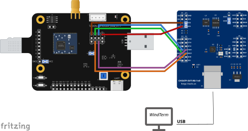

# orpah-client-demo — ORPAH 客户端（硬件 + 固件）

ORPAH（用无线技术找人）五仓里的**客户端侧**：**CH32V203 + 安全元件 ATECC608B + 泰芯 TX-AH
（802.11ah HaLow）模组**。目标是一台**免电池/低功耗**的客户端设备：周期性向 HaLow 路由器
上报「我还在」（Orpah ID 签名上报），必要时按电量降级，并配合服务端做定位与搜寻。

> **现状（2026-09-21）**：三块拼图都已上机验过：
> ① **自家固件**（`firmware/`，c3-2b）—— 控制台 + 1 ms 时基 + 心跳灯（板载 `D1`=PA15）+
>    **模组数据口**（USART2 ↔ TX-AH，HGIC 命令/应答双向通）；接线 / 判据 / 四个真凶见
>    `docs/c3-2b-bench-bringup.md`；
> ② **协议内核**（`proto/`）与 Python 参考**零偏差**（`python proto\run_cross_test.py` → exit 0）；
> ③ **b 步台架**（PC ↔ 模组）—— 控制面、数据面端到端、L2 全链路（含已签 `ORPAH-ID-REPORT`
>    验签通过）都跑通，见 `docs/txah-uart-macbus.md` 与 `ROADMAP.md` §二。
> **未做（如实）**：c4（选级 / 无 RTC / 自限频 / 已签上报）**未上机**；ATECC608B 未接线；
> 产线烧录、低功耗与取能标定未做；与 `orpah-over-halow` / `orpah-openwrt-demo` 的真机联调未做。
> ⚠ `AT+TXDATA`/`FRAME:RX` 那条路（`docs/nano-ch32v203-uart-bridge.md`）在**真模组上不成立**
> （fmac 固件的 AT 没有用户数据命令）—— 实际走通的是 **UART-MACBUS（HGIC 帧）**，即上面 ③。

## 台面长什么样（看图）

**c 步台架**（自家固件上机用的那套）：nanoCH32V203 + TX-AH EVB + CH347F 两个 PC 窗口 ——
CH347F 的 `P2`(UART0) 看我们的控制台、`P3`(UART1) 看模组的 AT/打印口：

[](hardware/wiring/cstep-ch347f-txah-evb-nanoch32.svg)

**b 步夹具**（PC ↔ 一块 TX-AH 模组；数据口 + AT/打印口各一路）：

[](hardware/wiring/bstep-ch347f-txah-evb.svg)

逐网规格与复验方式（用 `tools\fzz_nets.py` 把 Fritzing 网表逐网核对）见
[`hardware/wiring/README.md`](hardware/wiring/README.md)。

## 五仓分工（改动该往哪个仓放）

| 仓库 | 内容 | 与本仓的关系 |
|---|---|---|
| `Protocol`（`F:\git\Protocol`） | 通信协议规范：`docs/OrpahIDProtocol.md`（SN/校验/签名/密钥/降级/限频）、`docs/orpah-over-halow/SPEC.md` | **唯一权威**，固件严格遵循 |
| `orpah-over-halow`（`F:\git\orpah-over-halow`） | 业务全链路：服务端（UDP 19447）、Router 桥、走失表、Orpah ID 验签、定位/告警、Web UI、`host_bus.py`、`client.py`（PC 参考客户端） | 参考其协议定义与仿真器接口；**与本仓联调** |
| `halow-demo`（`F:\git\halow-demo\simulator`） | 空口/设备侧：`host/sim.py`（空口 + host 数据口）、`tools/ui/`、`firmware/`（CH32V203 参考固件）、真机实测记录 | 复用其**测试数据**与**固件骨架** |
| `orpah-openwrt-demo`（`F:\git\orpah-openwrt-demo`） | 路由器端 OpenWrt 软件（daemon + 包壳 + LuCI） | **与本仓对接测试** |
| **本仓** | **客户端硬件 + 固件** | — |

## 硬件形态（2026-09-14 用户定）

- **MCU**：CH32V203（QingKe V2，64K Flash / 20K RAM 级别），裸机、无 RTOS、`-nostdlib`。
- **安全元件（SE）**：ATECC608B —— 协议 §5.3 指定的 ECDSA P-256 载体（私钥不可导出）。
- **射频模组**：泰芯 **TX-AH**（AH-SDK V2 系列）。**PC ↔ 模块的数据面走 UART**（用户 2026-09-14 定）：
  `AT+TXDATA=<len>` + 裸以太帧上行、`FRAME:RX <hex>` 行下行（PC 侧实现见
  `orpah-over-halow/host_serial.py`；纯 PC 排练见 `demo_client_uart.py`）。
  ⚠ 仓里两份记录不一致（TC-Halow-RJ45 手册有 `AT+TXDATA`，`halow-demo` 真机实测说 fmac 的 AT
  无用户数据命令）→ **未在真机验证**，上机首测先确认（见 `orpah-over-halow/docs/client_sim.md` §2.3）。
- **工具链**：`riscv-none-elf-gcc`（**MounRiver** 自带；`-DWCH_INTERRUPT_FAST` 必须用它）。
- **烧录**：WCH-Link + OpenOCD（或 MounRiver 下载按钮）—— **由用户执行**。

## 固件要实现的（来自规范，逐条对着读）

| 主题 | 规范位置 | 客户端要做的事 |
|---|---|---|
| SN 编码/字符集 | `OrpahIDProtocol.md` §2 | 解析 `CC-ORG-UNIQUE[-CHECK]`，只认合法字符集，不套 Crockford 限制 |
| 校验码 Damm32 | §3 / 附录 B | 只算 `ORG-UNIQUE`（**不含 CC**） |
| Unicode 规范化 | §4 | 上报前按规范规范化字符串 |
| 签名与报文 | §5.1 / §5.4 | 组报文、算预像、ECDSA P-256 签名（SE）、`b64url` 编码 |
| 防重放/时间 | §5.5 | nonce/时间窗；**无 RTC 时 `ts=0`**，不改报文里的 `ts` |
| alg 白名单 | §5.6 | 只发白名单内的算法；ES256 优先，降级到 HS256 为下限 |
| 限频 | §5.8 | 设备侧自限频（**延后**而非丢弃） |
| 密钥 | §6.1/§6.2/§6.3/§6.4 | 1 把 P-256 私钥 + 1 把 HMAC，**一代终身不轮换**；私钥不可导出 |
| 降级 | §8.1/§8.2 | 四级降级流程；**永不降到 L3**（不能确认在场时宁可沉默） |
| 能量/覆盖 | `SPEC.md` §5.2 (E1–E4) | 由能量决定上报间隔与降级；设计常态 **60 s** 一次连接；沉默要能归因 |
| host 数据口 | `SPEC.md` §6 / `host_bus.py` | 帧格式与语义对齐 SPI MACBUS `DATA_TX`/`DATA_RX` |

## 目录（2026-09-21 实际）

```
orpah-client-demo/
├── firmware/     # CH32V203 固件（Makefile/启动/驱动/模组数据口；平台层四个真凶已修）
├── proto/        # 协议内核 C 实现 + 测试向量 + 跨语言交叉测试（run_cross_test.py）
├── tools/        # 上位机/联调脚本（host 数据口、串口、真机轮询、网表核对 fzz_nets.py）
├── docs/         # 上机记录、接线、踩坑（见下表）
└── hardware/     # 接线图（Fritzing .fzz + .svg 导出）
```

`docs/` 已有：

| 文档 | 内容 |
|---|---|
| `docs/c3-2b-bench-bringup.md` | **上机记录**：台架接线表、上电判据、实测证据、**四个真凶**（链接基址 0x0 / `IRQn` +16 / `mstatus` / TIM `INTFR`）、可复用的排查手法 |
| `docs/txah-uart-macbus.md` | 模组侧的 UART-MACBUS（HGIC 帧）：为什么选 UART、接线、协议要点、首测判据与分层排查、**双模块上行/下行实测**、§8.1 顺带量出的七条硬规矩、未做项 |
| `docs/nano-ch32v203-uart-bridge.md` | nanoCH32V203 刷 `SimulateCDC` 当 USB-UART 桥（COM32）、AT 验证；含 `AT+TXDATA` 在真模组上不成立的结论 |
| `docs/ch347f-txah-spi-probe.md` | SPI/电气探测（判据 = SD-SPI 的 CMD0/CMD5 有没有合法 R1） |

## 构建与烧录（2026-09-21 实测）

```bash
cd firmware
make            # -> build/orpah-client.elf / .bin / .hex（默认已指向本机 MounRiver 内嵌工具链）
make clean
```

```bash
# 烧录（用户执行）—— ★ 地址必须是 0x00000000（与 ld/link.ld 的链接基址一致）
openocd -f interface/wch-link.cfg -f target/ch32v20x.cfg \
        -c "program build/orpah-client.bin 0x00000000 verify reset exit"
# 或 WCHISPTool（下载方式 = USB，选 .bin/.hex）
# ⚠ 下载完**必须按一次 RST**（不按 = 什么也不发生，最容易被当成固件坏了）
```

## 自检（本仓口径）

- **协议内核跨语言零偏差**：同一批黄金样本/向量，Python 参考实现（`orpah-over-halow`）vs
  本仓 C 实现 —— 一键跑 **`python proto\run_cross_test.py`**（14 组快照 + 协议内核，实测 **exit 0**）。
- 判定口径：退出码 0 **且** 输出无 `FAIL`/`Traceback`（有些脚本自己吞异常还会往下跑）。

## 还没做（如实）

- **c4 上机**：选级 / 无 RTC / 自限频 / 已签上报（协议内核与模组通路都已验，但这四项还没上机）；
- **ATECC608B（SE）**：接线与驱动未做 —— 目前还没有让 SE 参与；
- 与 `orpah-over-halow`（服务端/仿真器）、`orpah-openwrt-demo`（路由器侧）的**真机联调**；
- 功耗实测（免电池取能曲线）、产线烧录流程落地。

（**已完成、别再说「未做」**：`proto/` 协议内核（与 Python 参考零偏差）、
固件平台层 + 控制台 + 1 ms 时基 + 心跳灯 + 模组数据口（c3-2b 上机）、
b 步台架与 L2 全链路（含已签 `ORPAH-ID-REPORT` 验签通过）。）

## 许可

**Apache-2.0**（与 `Protocol` / `orpah-over-halow` 一致；`LICENSE` 与 `orpah-over-halow` 逐字节相同，
SHA256 一致）。注：`Protocol` 另有一份 `NOTICE`（版权行），本仓按兄弟仓 `orpah-over-halow` 的做法
**只放 `LICENSE`**；若要补 NOTICE 请告知。

## 路线图

真机三步走（客户端 a→e / 路由器 a→e）与每步的交付物、判据、关键未知项见 **`ROADMAP.md`**。
其中 **a 步（软件里的客户端设备仿真器）已在 `orpah-over-halow` 完成**：
`client_sim.py`（`DeviceSim`）+ `demo_client_sim.py`（端到端验收）+ `docs/client_sim.md`。
