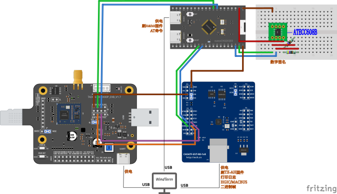

# ATECC608B 安全元件（c4-γ-2）：接线、命令来源、判据

> 这一步**只做一件事**：把 `payload.nonce` 的来源从**软熵**换成本仓 ATECC608B 的
> `Random(0x1B)`（规范 §5.4 要求 nonce 来自 SE 的 RNG）。
> **签名仍然是软件 P-256 替身** —— Slot0 私钥 / `Sign` / Config 锁 / 产线烧录都是 **d 步**。
> 这两件事必须**分开说**：`se` 命令与固件横幅里会同时打出 `se=stand-in(software P-256)`
> 和 `nonce_src=se|soft`，读的时候别合并成一句“已启用 SE”。

[](../hardware/wiring/cstep-ch347f-txah-evb-nanoch32-atecc608b.svg)

一张图说明这段接线（`.fzz` 工程与同名的 `.svg` 都在 `../hardware/wiring/`）：`nano` 的 `PB6/PB7`
走 I²C 到面包板上那块**绿转接板**（板上芯片印着 `CN`，就是 ATECC608B），旁边**两只 4.7 kΩ 上拉到 3V3**；
模组的口仍是 `PA2/PA3`，两个 UART 窗口还是 COM23 / COM24。
接线表见 `../hardware/wiring/README.md` 的「c4-γ-2 台架」一节；**逐根连线的网表复验**也在那里。
图里那块绿转接板旁边有一行蓝字 **`ATECC608B`**（带一小段蓝引线指向它）—— 这行字与引线
**在 `.fzz` 工程里**（挂在面包板那个「logo 图片」项的 `shape` 上），重新导出不会丢；
板上芯片本身只有 `CN` 一个丝印。

## 1. 引脚与电气

| 项 | 值 | 出处 |
|---|---|---|
| 封装 | 8-lead SOIC（本仓用的是 SOIC-8 → DIP 转接板） | 摘要手册 DS40002239A 图 1 |
| `pin4` = GND、`pin5` = SDA、`pin6` = SCL、`pin8` = VCC | — | 摘要手册表 1 |
| VCC / IO 电平 | 2.0~5.5 V / 1.8~5.5 V ⇒ **3.3 V 直接接** | 摘要手册 §1 Features |
| I²C 速率上限 | 1 MHz（我们用 **100 kHz**） | 摘要手册 §1 |
| 7 位地址 | `0x60`（写 `0xC0` / 读 `0xC1`），本仓未改出厂默认 | CryptoAuthLib 缺省 |

**接线（用户 2026-09-22 确认）**：`PB6 = SCL`、`PB7 = SDA`（I²C1 默认引脚），
**外接 4.7 kΩ ×2 上拉到 3V3**。⚠ 没有上拉就不可靠（内部上拉约 40 kΩ，只在低速时勉强）。

## 2. 唤醒与看门狗（这三个数都是**下界**，来自你自己的摘要手册 §2.3）

| 参数 | 最小 | 含义 |
|---|---|---|
| `tPU` | 100 µs | 上电后到可以拉 SDA 的时间 |
| `tWLO` | 60 µs | 把 SDA 拉低这么久（唤醒脉冲） |
| `tWHI` | 1500 µs | SDA 拉高后到可以发数据 |
| `tWATCHDOG` | 0.7 / 1.3 / 1.7 s | 唤醒后这么久没收到**合法命令**就自己回睡 |

⇒ 我们 60 s 才发一条 ID，**每条命令前都必须重新唤醒**（`Periph/atecc.c` 就是这么做的）。
唤醒**不是靠猜时间**：拉完脉冲后发一个"唤醒令牌"（I²C 写地址 `0x00`），**收到 ACK 才算醒** ——
这是 CryptoAuthLib `hal_check_wake()` 的做法。

⚠ 拉低 SDA 那一下必须**先把 I²C 外设关掉**（`i2c_disable()`）：否则外设会把
"SCL 高时 SDA 下降"当成一次 START，后面等 `SB` 就会在错的时刻满足。

## 3. 命令集：我们手上没有 NDA 版手册，用公开实现（**逐条标出处**）

`D:\Downloads\ATECC608B.pdf` 是 **Summary Data Sheet**（28 页），开头就写明
"The complete document is available under NDA" ⇒ **它没有命令集**。所以命令层的事实
取自同厂开源的 CryptoAuthLib（`MicrochipTech/cryptoauthlib`）：

| 事实 | 值 | 出处 |
|---|---|---|
| `Random` 命令码 | `0x1B` | `lib/calib/calib_command.h`（`ATCA_RANDOM`） |
| 模式 | `0x00` 自动更新种子 / `0x01` 不更新 | 同上（`RANDOM_SEED_UPDATE` / `RANDOM_NO_SEED_UPDATE`） |
| 返回数据长度 | 32 B | 同上（`RANDOM_NUM_SIZE`） |
| 无数据命令包长 | `ATCA_CMD_SIZE_MIN` = count+opcode+param1+param2+CRC = **7**（不挂 CRC 时 5） | 同上 + `lib/calib/calib_command.c` 的 `atCalcCrc()` |
| 命令最多耗时 | 23 ms（另一张表 50 ms） | `lib/calib/calib_execution.c` |
| CRC 算法 | poly `0x8005`、初值 0、**MSB-first** | `calib_command.c` 的 `atCRC()`：`crc_bit = crc_register >> 15; crc_register <<= 1` |
| CRC 线上字节序 | **小端**（低字节在前） | 同上：`crc_le[0] = crc & 0xFF` |
| 响应 count | 32 B 数据的响应 = `ATCA_RSP_SIZE_32` = **35**（这是 CryptoAuthLib 内部计数口径） | `lib/calib/calib_command.h` |

★ 上面那个 CRC 就是 **CRC-16/BUYPASS**（CRC 目录里的标准项）⇒ 它的**目录校验值**
`"123456789" → 0xFEE8` 被我们当作**外部黄金向量**钉在 `proto/crc16.c` 与
`proto/atecc_cli.c selfcheck` 里 —— 不是"我们自己算的、自己验的"。

## 4. 两处**待上机确认**的假设（写在这里，不要猜）

1. **响应 count 的口径**：我们按"`count` = 4（大端 count 自身）+ 32（数据） [+2（CRC）]"
   实现 ⇒ 期望线上读到 **36**（无 CRC）或 **38**（带 CRC）。
   CryptoAuthLib 内部那个 `ATCA_RSP_SIZE_32 = 35` 是它**存进缓冲后**的计数口径，
   两者不是一回事；真机上如果对不上，`se` 命令会把**实测的原始字节和长度打出来**
   （`[se] Random FAILED … last_resp_len=… raw=…`）—— 按它改常量，**别连试好几轮**。
2. **线上要不要挂 CRC**：取决于芯片 Config 区 `ChipMode` 的 I2C-CRC 位，而我们的摘要手册
   没给这个默认值 ⇒ 不猜：`atecc.c` **先按不挂 CRC 发一条，count 不是 36 再按挂 CRC 发一条**，
   哪一种通就**记住**（`se` 命令会显示 `no-crc(响应 36 B)` 或 `crc(响应 38 B)`）。
   判定结果请记到这里（下面第 6 节），下次就不用再判。

## 5. 代码分工（三层，别互相渗透）

| 文件 | 管什么 | 能否在 PC 上跑 |
|---|---|---|
| `proto/crc16.c` | CRC-16/BUYPASS（纯函数） | ✅ 交叉测试 |
| `proto/atecc_msg.c` | Random 命令包 / 响应解析（纯函数） | ✅ 交叉测试 |
| `Periph/i2c.c` | 硬件 I2C1 主机（含**有上限**的等待） | ❌ 硬件 |
| `Periph/atecc.c` | 唤醒脉冲 + 事务 + 自检 + 给 `id_build` 的 nonce provider | ❌ 硬件 |
| `proto/id_build.c` | 流水线：**nonce 来源可注入**（`idb_set_nonce_fn`） | ✅ 交叉测试（不注入 ⇒ 软熵，可复现） |

对拍口径（AGENTS §4）：`python proto\run_cross_test.py` → 现在 **16 组**，其中
`crc-selftest`（7 行）/ `msg-selftest`（9 行）与 Python 参考**零偏差**。

## 6. 上机判据（跑完把实测的填进这张表）

一键跑法（PC 侧，**先把 WindTerm 等串口窗口关掉** —— Windows 串口独占）：

```
C:\Python313\python.exe tools\check_c4g2_bench.py                  # 全流程（SE + ID 上报 + 可选模组口）
C:\Python313\python.exe tools\check_c4g2_bench.py --no-idsend      # 只判 SE
C:\Python313\python.exe tools\check_c4g2_bench.py --from-file log.txt   # 离线解析一段日志
```

它会自己判下面 1–5 条（退出码 0 = 全过 / 2 = 有 FAIL / 1 = 环境问题），并把
**`crc_mode` 与 `nonce_src`** 打在最后让你填回这张表。

| # | 命令 | 期望 | 实测 |
|---|---|---|---|
| 1 | 控制台 `se` | `[se] wake: ACK` + `[se] Random(0x1B) 32 B ok` + `前 16 B = …` | **未做** |
| 2 | `se` 显示的 CRC 模式 | `no-crc(响应 36 B)` 或 `crc(响应 38 B)` | **未做** |
| 3 | 连按两次 `se` | 两次 32 B **不同**（RNG 真的在动） | **未做** |
| 4 | 控制台 `id` | `nonce_src=se`（拔掉 SE 则**如实**回退 `soft`） | **未做** |
| 5 | 控制台 `idsend` + COM24 | 帧仍 395 B、模组侧 `[mbus rx] 403 byte(s)`、上游 `verify_report` 接受 | **未做**（本轮是 γ-1 的记录） |

## 7. 如实边界（别包装成"已支持"）

- **签名不是 SE 做的**：`level=0` 仍是演示级的软件 P-256 ⇒ `se_ok` 仍为 1 的含义
  只是"能做 ES256"，与"SE 在签"**不是一回事**。
- **唤醒脉冲宽度没上示波器**：靠忙等（`i2c_delay_us`，近似、只保证"至少"，
  并且两处约束都是**下界**所以宁可长）；**没有实测过真实宽度**。
- **I²C 时钟假设 APB1 = 8 MHz**（无 PLL、无分频）。改主频/分频要同步改 `Periph/i2c.c`
  里的 `I2C_FREQ_MHZ`，否则会表现为地址 NACK 或读出全 `0xFF`。
- **不保证 nonce 全局唯一**：SE 的 RNG 只保证"高质量随机"，去重仍是服务端的事（§5.5）。
  跨设备/跨重启的碰撞概率按 2⁻¹²⁸ 计（取 16 字节），但**我们没有实测统计过**。
- **Config 区没读过**：本步不读、不写芯片配置；`Random` 不需要 Slot0 或任何 provisioning
  锁（它只用内部 RNG）—— 这是**公开实现的用法**推出来的，上机第 1 条判据就是它的验证。
