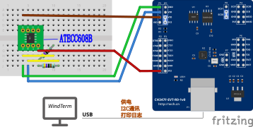

# CH347F 当独立 I²C 主机（B 方案：把 nano 固件排除在外）

> 工具：`tools/ch347_i2c.py`（PC 侧，走 WCH 官方的 `CH347DLLA64.DLL`）。
> 目的：SE（c4-γ-2）在台架上"**地址被 ACK、字节收下、但从不回应**"。
> 我们固件侧已经把能自查的都自查了（响应字地址 `0x00`/`0x03` 两种都试、逐字节 `BTF`+`AF`、
> 两种 CRC 模式、10/50/100 kHz、写/读两个方向的地址探针），仍然读不回一个字节。
> ⇒ 现在需要一个**完全独立的主机**来判：
> **是「器件不讲 CryptoAuth」**，**还是「我们固件还有毛病」**。

## 1. API 出处（逐条标出处；头文件 = `CH347DLL_EN.H` V1.5）

| 函数 | 用途 / 关键参数 | 头文件行 |
|---|---|---|
| `CH347I2C_Set(iIndex, iMode)` | 速度位 `bit1:0`：`00`=20 kHz、`01`=**100 kHz（缺省）**、`10`=400 kHz、`11`=750 kHz；其余位必须 0 | V1.5 §I2C |
| `CH347I2C_SetStretch(iIndex, en)` | 时钟延展开关 | 同上 |
| `CH347I2C_SetDelaymS(iIndex, ms)` | 下一次流操作前的硬件延时 | 同上 |
| `CH347I2C_SetDriverMode(iIndex, m)` | `0`=开漏（缺省）、`1`=推挽 | 同上 |
| `CH347StreamI2C(idx, wLen, wBuf, rLen, rBuf)` | **`wBuf` 第一个字节 = 「器件地址 + 方向位」**（8 位形式，如 `0x60` 写 = `0xC0`）；后面字节是"字地址/寄存器地址" | 同上 |
| `CH347StreamI2C_RetACK(..., PULONG rAckCount)` | **回 ACK 计数**（主机端收到的 ACK 个数）⇒ "器件到底 ACK 了没有"的**独立判据**，不依赖我们固件里对 `AF` 标志的解读 | 同上 |

版本注意：不是所有 DLL 版本都导出 `SetStretch`/`SetDelaymS`/`SetDriverMode` ——
工具里是**有就绑、没有就跳过**（别因为一个可选函数整个工具不能用）。

## 2. 接线

```
   PC ──USB── CH347F-EVT ──P5(I²C)── 面包板上的 SE（+ 两只 4.7 k 上拉到 3V3）
                             └─3V3/GND ─ 给上拉与 SE 供电（SE 空闲只有 µA 级，够）
   ★ nanoCH32V203 这轮**必须停止驱动总线**：断电，或者按住 RST。
     （两个主机同时驱动同一对线 = 谁都不对；而且 nano 的 4.7 k 上拉可以留着。）
```

- **P5 = I²C 排针**：出处是 `docs/ch347f-txah-spi-probe.md` 的排针表（P4=SPI、**P5=I2C**、P6=JTAG）。
  ⚠ **P5 上哪只脚是 `SCL`、哪只是 `SDA`，我们没核实过**（本仓没有 CH347DS1 第 13 页）——
  接线时**按板子丝印认**（丝印通常是 `SCL`/`SDA`/`3V3`/`GND`）。
- 共地；`3V3` 与 nano 那套是同一个网（同一片面包板的电源轨）。

## 2b. 接线图（2026-09-23 已核对）

[](../hardware/wiring/cstep-ch347f-atecc608b.svg)

**`hardware/wiring/cstep-ch347f-atecc608b.fzz`** —— 用 Fritzing 打开即可照插。
按 `tools/fzz_nets.py`（已登记规格）从 `.fzz` 里读出来**真实网表**，逐网核对结论：

| 网 | 图上实际 |
|---|---|
| 数据线 | `CH347F.SDA`(P5 pin1) ↔ `ATECC608B.SDA`(pin5 @F4) ↔ `R1` 一端 |
| 时钟线 | `CH347F.SCL`(P5 pin2) ↔ `ATECC608B.SCL`(pin6 @F5) ↔ `R2` 一端 |
| 3V3 | `CH347F.3V3` ↔ `ATECC608B.VCC`(pin8 @F7) + `R1`/`R2` 另一端（两只 **4.7k**） |
| 地 | `CH347F.GND`（**P5 pin3**）↔ `ATECC608B.GND`(pin4 @E4) |

- SE 的 4 个 NC 脚（pin1/2/3/7 @E7/E6/E5/F6）**悬空** ✓（图上只插在空孔里）。
- **图上没有 nano** ✓ —— 这正是 B 方案的意思（两个主机不同时驱动同一对线）。
- **SE 的插入朝向**（`ATECC608B` 部件自带的丝印数字 1..8 在图上可见）：
  缺口朝**右**（第 8 列那侧）⇒ pin1 在 E7、pin4 在 E4、pin5 在 F4、pin8 在 F7。
  照板上的数字插即可。
- ⚠ **取脚位置**（电气上都不是错，但接线时要跨排针，且有一条要你确认）：
  1. **SDA / SCL / GND 三根都落在 `P5` 这个排针上**（P5 pin1/pin2/pin3 —— 2026-09-23 用户已把地
     从 `JP1` 那列的 GND 改到 `P5` 自带的 GND，落孔 `A4` → `B4`，同列同网）；只有 **3V3 取自 `P2` 排针末端**。
     板内 3V3 同一轨 ⇒ **电气等价**，只是接线时电源要另找一根。
  2. `P5` 第 4 脚的丝印是 **`VIO`**（不是 3V3），图上**没接**；而我们的 CH347F 部件生成脚本注释里写的是
     "P5 = SDA/SCL/GND/3V3" —— **两者不一致，以丝印为准**。⇒ 上机前先确认 **`JP1` 已把 VIO 跳到 3V3**
     （I²C 的 IO 电平跟着 VIO 走）。**这条我没核实过**（只有部件丝印与原理图抄本，没有 CH347DS1 原文）。
  3. `JP1` 是 VIO 电平跳线块（丝印上→下 = `GND/VIO/VIO/3V3`）⇒ 那一块上**如果有跳线帽，别和我们的线搞在一起**
     （我们的线只走 `P5` 与 `P2` 末端，不占 `JP1`）。
- **没核的**：画面上线头是否真落在它声称的孔上（本工具读的是连接关系，不渲染）；P5 的丝印脚序本身。

## 3. 怎么跑

```
cd F:\git\orpah-client-demo
C:\Python313\python.exe tools\ch347_i2c.py list                  # 认设备（缺省 iIndex=0）
C:\Python313\python.exe tools\ch347_i2c.py scan                  # 扫 0x01~0x7F，写/读方向都探
C:\Python313\python.exe tools\ch347_i2c.py scan --clk 0          # 20 kHz 对照
C:\Python313\python.exe tools\ch347_i2c.py atecc 64 --op random --waddr 03 --resp-waddr 00
C:\Python313\python.exe tools\ch347_i2c.py atecc 64 --op info   --waddr 03 --resp-waddr 00
C:\Python313\python.exe tools\ch347_i2c.py atecc 64 --op random --waddr 03 --resp-waddr 00 --crc
C:\Python313\python.exe tools\ch347_i2c.py xfer 64 001B0000 --waddr 03 --read 36
```

判据：

| 命令 | 看什么 | 含义 |
|---|---|---|
| `scan` | `0xNN：写方向 ? / 读方向 ?` | 两个方向都 ACK = **真从机**（与我们固件那边的结论对照）；一个都不答 = 这轮接线/供电有问题 |
| `atecc … --op random` | ① `ACK 计数` | 期望 = `地址 + 字地址 + 包长`；**少了就是中途被 NACK**（能定位到第几字节，比固件侧更可信） |
| 同上 | ② 读回 36/38 字节的 `count` 与 `CRC` | `count` 合法（8/10/36/38）+ CRC 对 ⇒ **器件真的回了响应** ⇒ 那我们固件侧还有问题 |
| 同上 | ② 读回全 `FF` | **从机一个字节都没驱动** ⇒ 器件没准备响应 / 不认这条命令 |

★ **一条硬边界（2026-09-23 实测后补）**：CryptoAuth 器件在 **Sleep 时对任何地址都不 ACK**，
唤醒必须靠**事务之外**的 SDA 低脉冲（≥ `tWLO` 60 µs，**SCL 保持高**；我们固件
`firmware/Periph/atecc.c` 的 `wake_pulse()` 为此把 I²C 外设关掉当 GPIO 用）。
CH347 的 I²C 控制器**只会发成帧事务**（SCL 一直在跳）⇒ **它唤醒不了睡着的器件**。
⇒ 「`scan` 扫不到」**单独不构成判决**；要判器件在不在，只能：
① 抓**上电后的 Idle 窗口**（见 §4 的守候工装），或 ② 让**能发脉冲**的主机（nano 固件）来扫。

## 4. 本机实测

- `selftest`（离线）：Random 包 `05 1B 00 00 00`、带 CRC `07 1B 00 00 00 6E DD`、
  Info 包 `05 30 00 00 00` —— 与**固件侧向量** `proto/test_vectors_atecc.txt` 的
  `cmd 0 1 → 071b0000006edd` **逐字节一致**（组包用的是同一套 CRC 参考，见下）。
- `list`：`iIndex=0：CH347F，I²C 初始化 成功`（`CH347I2C_Set` 返回真）⇒ DLL 路径可用。
- **接上 P5 之后的实测（2026-09-23 13:4x，用户已按 `cstep-ch347f-atecc608b` 接好线）**：
  - **正对照 ✅**：`xfer 50 --waddr 00 --read 8` → 读回 `FF ×8`。`0x50` = **CH347F-EVT 板载的
    24C02 EEPROM**（部件丝印上就有它）⇒ 主机 + DLL + 总线 + 上拉**能真的搬数据**；
    `probe()` 的 ACK 计数也在这台器件上拿到了**非零**值（地址 `0x00` 上拿到 0 = 负路径）
    ⇒ “ACK≥1 判有从机”这条判据两头都标定过了。
  - **扫 `0x01~0x7F`**（写 + 读两个方向；20 kHz 与 100 kHz 各一遍）：**只有 `0x50`**，
    SE 的候选地址 `0x60/0x62/0x64/0x66` **一个都不 ACK**。
  - 试过在事务里写 `0x00` 字节（100 kHz = 90 µs 低、20 kHz = 450 µs 低）当唤醒 —— **无效**；
    写 33 字节的超长低电平被 DLL 拒（`CH347StreamI2C_RetACK 失败`，写缓冲上限）。
  - **Idle 窗口守候**（工装：每轮 0.26 s 扫全地址，抓到新器件立刻发 `Info`/`Random`）：
    请用户给 SE 的 3V3 **上下电 2 次**，937 + 412 轮里**只有 `0x50` 在 ACK**，没等到新器件。
  - ⇒ 三次独立测试（nano 带**正确唤醒脉冲**的 `sewake`、本工具的 `scan`、本工具的 Idle 守候）
    **同向**：这颗 SE 在线上不应答。下一步是**物理量测**（见 §5 末条），不是继续调软件。

## 5. 未做 / 边界（如实）

- **P5 的脚位未核实**（见 §2），接线以板子丝印为准。
- `CH347StreamI2C_RetACK` 的 ACK 计数语义按头文件注释（"主机端收到的 ACK 个数"）使用，
  **没有在真从机上标定过** ⇒ 第一次用建议先拿一个**已知会 ACK 的器件**（或那颗 SE）
  对一下"期望值 = 地址 + 字地址 + 包长"到底对不对。
- 报文组包**复用** `proto/run_cross_test.py` 的 `py_crc16()`（单一源；那份 CRC 已有
  `test_vectors_crc16.txt` 与 C 实现交叉验证），**本工具不另写一份 CRC**。
- 工具不做任何写操作（不发 `Nonce`/`Sign`/`Write`/`Lock`）；`atecc` 只跑只读的
  `Info`/`Random`。
- **`--read` 打印的字节不是判据**：地址没人 ACK 时也会打出 `00`/`FF`（读缓冲里的值）——
  判“器件在不在”只看 **ACK 计数**（`scan` 的 `写/读方向 ACK`、`xfer` 不带 `--read` 时的 `ACK 计数`）。
- **下一步（物理量测，2026-09-23）**：在“三次测试都无 ACK”之后，先量这几条再动软件：
  ① SE `pin8`(VCC) ↔ `pin4`(GND) 应约 **3.3 V**（图上 3V3 取自 **P2 排针末端**）；
  ② SE `pin5` ↔ `P5` 第 1 脚、`pin6` ↔ `P5` 第 2 脚 **通断**（0 Ω）；
  ③ **插装方向**：图上 `pin1` 在**右端 E7**、`pin4` 在**左端 E4**、**缺口朝右** —— 照部件丝印数字插；
  ④ SOIC-8→DIP 转接板的脚常常短而细 ⇒ **拔下来重插**（或换一列空孔）再试一次上下电。
