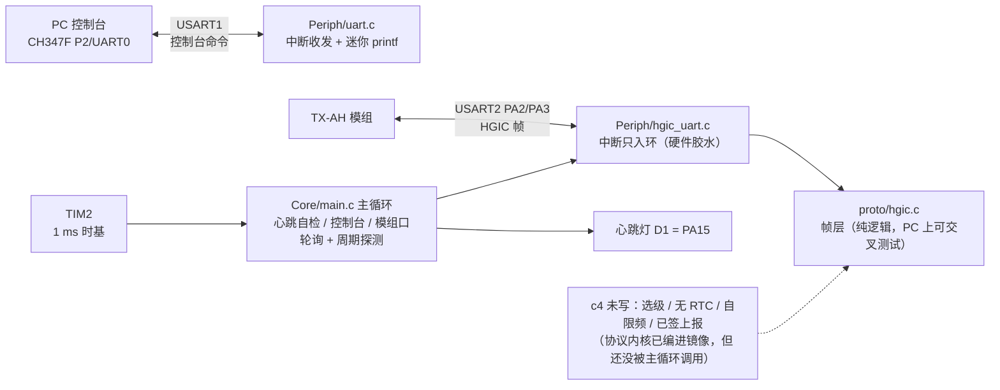
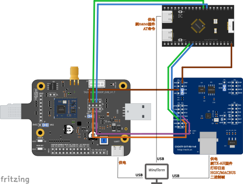

# firmware/ — ORPAH 客户端固件（CH32V203 + TX-AH）

**状态：c3-2b ✅ 2026-09-21 真机全绿** —— 自家固件在 nanoCH32V203 上跑起来：
横幅 + 1 ms 时基 + 心跳灯（板载 `D1`/PA15）+ 控制台命令，且
**UART2 ↔ TX-AH 的 HGIC 数据口双向通**（发 `GET_UART_FIXLEN` 收到模组 CMD 应答）。
台架接线、上电判据与**四个真凶**见 `../docs/c3-2b-bench-bringup.md`。

> c4（选级 / 无 RTC / 自限频 / 已签上报）**未上机**；ATECC608B 未接线。
> 上机与烧录**由用户执行**；本仓不把"编译过"写成"跑过"。

## ★ 四条硬规则（上机踩出来的，改固件前先看）

| # | 规则 | 不改会怎样（实测） | 在哪 |
|---|---|---|---|
| 1 | **链接基址必须 `0x00000000`** | 烧到 `0x08000000` 的镜像**一条指令都不执行**（灯不亮、串口全静默） | `ld/link.ld` 的 `MEMORY` |
| 2 | **`IRQn_Type` 必须带 `+16` 异常号偏移**（`WWDG=16 … TIM2=44, USART1=53, USART2=54`） | 中断**一个都进不来**（`NVIC_EnableIRQ` 把值直接当 PFIC 位号用） | `Core/ch32v20x.h` |
| 3 | **`mstatus` 写 `0x1888`（MPP=0b11）**，不是 WCH 的 `0x88` | `main` 里**任何 CSR 访问都出事**、写 PFIC **静默失效** | `startup/startup_ch32v203.S` |
| 4 | **TIM 的 `INTFR` 是 write-all-bits（清标志写 0）**；`ATRLR` 不能为 0 | 写 1 去清 ⇒ **ISR 死风暴**（连横幅都打不出来）；`ATRLR=0` ⇒ **没有更新事件**、`tick` 冻住 | `Core/main.c` 的 `tick_init`/`TIM2_IRQHandler` |

另：**烧录下载完不会自动运行，必须按一次 `RST`**（不按就是"刷完什么也没有"）。

## 这是什么

CH32V203 裸机（无 RTOS、无 libc、`-nostdlib`）固件：控制台（USART1）+ 1 ms 时基（TIM2）
+ 心跳灯（PA15）**+ 模组数据口**（USART2 ↔ TX-AH，HGIC 帧层）。
**只有这些**：协议内核（`proto/`）已编进镜像但**还没被主循环调用**，
选级/无 RTC/自限频/已签上报（c4）都还没写（见 `../ROADMAP.md` §五）。

## 目录

```
firmware/
├── Makefile                    # riscv-none-embed-gcc 构建（工具链路径见下）；链 proto/*.c（-lgcc）
├── ld/link.ld                  # 64K Flash / 20K RAM；★ FLASH ORIGIN 必须 0x00000000
├── startup/startup_ch32v203.S  # QingKe V2 启动：向量表 + 复位 + 清 bss + csrw 0x804,0x3 + mstatus 0x1888
├── Core/
│   ├── ch32v20x.h              # 寄存器定义（自包含，无 CMSIS）；★ IRQn_Type 已按 WCH +16
│   ├── board.h                 # 引脚/波特率/IRQ 属性（控制台/模组口/心跳灯 + 各自的时钟位）
│   └── main.c                  # SystemInit + main：心跳自检/控制台/模组口轮询 + 周期探测
└── Periph/
    ├── gpio.c/h                # gpio_set_mode / gpio_set_pin / gpio_get_pin
    ├── uart.c/h                # 中断收发 + 迷你 printf（uart_init/uart_putc/uart_write/uart_printf）
    └── hgic_uart.c/h           # 模组数据口胶水：USART2 中断只入环，主循环喂 proto/hgic.c 的帧层
```

帧层本体在 `../proto/hgic.{h,c}`（纯逻辑、可在 PC 上交叉测试）；`Periph/hgic_uart.c`
只做**硬件胶水**（中断/环缓冲/回调），两侧不改协议。

所以固件里就三件事：控制台、1 ms 时基、模组数据口（虚线框 = 还没接上）：



上机那套台架（图已逐网核对，与 `../docs/c3-2b-bench-bringup.md` 的接线表一致）：

[](../hardware/wiring/cstep-ch347f-txah-evb-nanoch32.svg)

## 构建

**必须用 MounRiver Studio 自带的那份工具链**（`-DWCH_INTERRUPT_FAST` 依赖它的
`interrupt("WCH-Interrupt-fast")` + 启动文件里的硬件栈配置；独立 xPack 版**会跑飞**）。

本机 2026-09-20 实测可用的路径与版本：

```
F:/MounRiver/MounRiver_Studio2/resources/app/resources/win32/components/WCH/Toolchain/RISC-V Embedded GCC/bin/
  riscv-none-embed-gcc.exe  → "xPack GNU RISC-V Embedded GCC 8.2.0"
```

⚠ 前缀是 **`riscv-none-embed-`**，不是 `riscv-none-elf-`。`Makefile` 的 `RISCV_PREFIX`
默认就指向上面这个路径；换机器用 `make RISCV_PREFIX='.../bin/riscv-none-embed-'` 覆盖。

⚠ Windows 上 make 的 recipe 要 POSIX 命令（`mkdir -p` / `rm -rf`）⇒ 需要一个 sh。
实测可用：

```bash
# Git Bash 或任何带 sh 的环境
make SHELL='D:/Program Files/Git/bin/sh.exe'
# 或在 Git Bash 里
make
```

产物（实测尺寸）：

```
build/orpah-client.elf
build/orpah-client.bin   6400 B   ← 烧这个（WCHISPTool，下载方式 = USB）
   text 6398 / data 0 / bss 20224
```

> `bss` 看着接近整个 RAM（20 KB）**不是真用掉了**：`link.ld` 里 `.heap (NOLOAD)` 从中段
> 一直预留到 `RAM 顶端 − 256`，`size` 把它算进 bss；`sp = _eusrstack` 从 RAM 顶端向下长。

## 烧录（**由用户执行**）

**镜像基址 = `0x00000000`**（硬规则 1）—— 用 SWD 时下面的地址别写错：

```bash
# A) WCH-Link / SWD
openocd -f interface/wch-link.cfg -f target/ch32v20x.cfg \
        -c "program build/orpah-client.bin 0x00000000 verify reset exit"
# B) WCHISPTool（BOOT+RST 进刷机态，不需要 COM 口）；或 MounRiver 的下载按钮
make flash      # 只打印提示，不代跑
```

WCHISPTool 流程：按住 `BOOT` → 按/放 `RST` → 松 `BOOT` → 选 `build/orpah-client.bin`（下载方式 USB）→
**下载完必须按一次 `RST`**（不按不会运行）。

## 上电后应该看到什么（判据）

1. **板载 `D1`（蓝）**：灭 ~0.3 s → **3 下短闪** → 之后 **~1 Hz 心跳**；
2. 控制台（115200 8N1）打出 `[orpah-client] CH32V203 firmware ...` + `type 'help' for commands`；
3. 键 `AT` + 回车 → 回 `OK (rx=N)`；`stat` → 计数器（含 `tick=`/`loops=`，两个都在涨 = 时基与主循环都好）；
4. **每 3 s** 自动探测数据口：`[mod] tx GET_UART_FIXLEN #N, waiting reply...`，
   模组应答时打 `[mod] ctrl type=3 id=109 status=0 len=2` + `[mod] **DATA PORT IS UP**`；
5. 模组的 AT/打印口（COM24）同步看到 `[mbus rx] 9 byte(s) ...` 与 `[mbus tx] 14 byte(s) ... resp cmd, ret:2`。

> 判据是"**收到 CMD 应答**"，不是"我们写出去了" —— 与 PC 侧 `tools/hgic_bus.py::ping()` 同一口径。

## 台架引脚（2026-09-21 实测）

| 用途 | 本固件 | 对端 | 说明 |
|---|---|---|---|
| 控制台（打印/调试） | **USART1 = PA9(TX)/PA10(RX)** | CH347F `P2/UART0` = COM23 | 115200 8N1 |
| 模组数据口（HGIC） | **USART2 = PA2(TX)/PA3(RX)** | 模组 `A10`(RX) / `A11`(TX) | 115200 8N1；模组侧是**固定**的 |
| 模组 AT/日志口 | —（不接 MCU） | 模组 `A12`(RX) / `A13`(TX) = CH347F `P3/UART1` = COM24 | 看模组原样输出 |
| 心跳灯 | **PA15**（低有效，板载蓝灯 `D1`） | — | `3V3 → R3(10K) → D1 → PA15`；出厂 `blink_1000.bin` 驱动 `GPIOA` `0x8000` 旁证 |

引脚口径全在 `Core/board.h`（含各自的**端口时钟位** —— 换引脚时时钟位要跟着改）。
完整接线与三个真凶见 `../docs/c3-2b-bench-bringup.md`

## 与参考固件的关系（来源已注明）

骨架的**套路与部分基础设施文件**来自 [halow-demo/simulator/firmware](https://github.com/Orpah/halow-demo)
—— 那是**我们自己仓的代码**（非第三方），按 `../AGENTS.md` §1「沿用参考骨架的套路，不另起一套风格」复用：

| 文件 | 处理 |
|---|---|
| `Periph/gpio.*`、`Periph/uart.*`（骨架部分） | **原样搬过来**（只删掉了模拟器专有的 SPI/灯/拨码） |
| `Core/board.h` | **重写**：模拟器的 SPI/LED/DIP 换成 ORPAH 的控制台 + 模组数据口 + 心跳灯 |
| `Core/main.c` | **重写**：横幅 + 心跳 + 周期探测 + 控制台命令（`AT`/`ping`/`stat`/`send`/`help`） |
| `ld/link.ld`、`startup/startup_ch32v203.S`、`Core/ch32v20x.h` | **不再原样**：上机后发现三处根因（链接基址、`IRQn_Type` +16、`mstatus` MPP）已就地修，详情见 `../docs/c3-2b-bench-bringup.md` §4 |
| `Makefile` | 照抄结构，改三处：① `RISCV_PREFIX` 默认指向 MRS2 内的 `riscv-none-embed-`；② 修掉一个 bug —— 参考版写的是 `objcopy -O binary $@ $<`（把**输出**当输入），所以它的 `.bin` 目标其实跑不通，本版改成 `$< $@`；③ 加 `-lgcc`（`jcs.c`/`sha256.c` 的 64 位除/模/右移要用 libgcc，不加则 `--gc-sections` 一关就链不过） |
| `Periph/hgic_uart.*`、`proto/*` | **本仓新增**（参考仓没有）：HGIC 数据口胶水 + 协议内核 |

> ⚠ **同源缺陷已回灌到参考仓（2026-09-21）**：上面 ①/②/③ 三个根因都在**逐字搬过去的文件**里，
> 所以 `halow-demo/simulator/firmware/` 有同样的问题 —— **已回灌修好并提交**（那边 `d981896` /
> `8da9c48` / `cb1b7a1`：链接基址 `0x0`、`IRQn_Type` +16、`mstatus 0x1888`、向量表在 0x8、
> `uart_init` 补外设时钟、Makefile 的 objcopy 反参、Makefile 在 Win11 上能 `make`）。
>
> ★ **两个仓各自独立、各留一份平台层**（用户 2026-09-21 判定：不抽公共库、不做 submodule）——
> 代价是**同一处坑不能在一边修完就算完**。平台层这 **7 个文件**要两侧同步：
> `ld/link.ld`、`startup/startup_ch32v203.S`、`Core/ch32v20x.h`、`Periph/gpio.{c,h}`、`Periph/uart.{c,h}`；
> 改任一侧时**顺手把另一侧也改掉**，并各自标清「哪一侧上机验证过」（本仓 = 已上机，
> 记录见 `../docs/c3-2b-bench-bringup.md`；那一边 = **未上机**）。

## 下一步（别在这里自由发挥，按阶段来）

- **c4（进行中）**：把协议内核实接进主循环 —— §8.2 选级 + 无 RTC（`ts=0`/`cap.rtc=false`）
  + 自限频 + 已签 `ORPAH-ID-REPORT`。
  · **c4-γ-1 ✅（2026-09-22，未上机）**：主循环已接上（`Core/id_core.c`，流水线本体在
    `../proto/id_build.c`；两侧**同一份源码**）。上电后**每 60 s**（= 设计常态）自动发一条；
    控制台新增 `id`（状态/计数）、`idsend`（立即发，受自限频约束）、`idhex`（把上一帧打成 hex，
    拿去 PC 侧 `tools\check_report_hex.py` 判一次）、`idmodes` / `idlevel <m>`（§8.2 故障注入）。
  · 判据（PC 上已过）：`python ../proto\run_cross_test.py` → exit 0，**15 组**；
    其中★**上游 `verify_report()` 收下 C 产出的整帧**（level=0/1/2 全过）。
  · 实测尺寸：`text 25916 / data 10 / bss 20208`；`_ebss`→栈顶 = **4420 B** 可用栈（
    `size` 报的 bss 把 NOLOAD 的 heap 标记也算进去了）；签名路径静态栈用量最深处 ≈ **2.4 KB**
    （`-fstack-usage` 实测：`idr_build` 1024 + `p256_point_mul` 576 + `ecdsa_sign_p256` 432 …）。
  · ★ **已上机（2026-09-22，内容判据过了）**：`C:\Python313\python.exe ..\tools\check_c4g1_bench.py`
    → 固件活着（`AT`→`OK`）+ 帧 395 B + **上游 `verify_report` 接受（level=0 / trust=high / cap.rtc=false）**。
  · ★ **实测耗时：一条 = `build_ms=9107`（≈9.1 s）**（8 MHz 上 ES256：费马求逆 + ladder；含取钥/nonce/
    信封/套帧）。设计常态 60 s ⇒ 占空 ~15%，可接受。
    ⚠ **如实**：这 9.1 s 里主循环是**阻塞**的（控制台要等它跑完才回话；模组下行字节只靠 1 KB 环缓冲，
    可能 `ring_drop`——那是**可见计数**）。台架上没下行流量时无影响；真要解掉得把签名拆成分步状态机（未做）。
  · ⚠ **待模组侧确认**：本轮台架模组整块安静（COM23 每 3 s 探测无应答、COM24/COM8 读 8s 零字节）⇒
    “帧有没有真的进模组”待模组恢复后再看（COM24 上的 `[mbus rx] <8+len> byte(s)`）。
  · 如实：本 demo 的 `se_ok` 是**软件 P-256 替身**（SE 在 d 步）⇒ `level=0` 是演示级；
    `payload.nonce` 用的是**软熵后端**（非生产强度，见 `../proto/id_nonce.h`）。
  · **c4-γ-2（待做）**：ATECC608B 接上后把 nonce 后端换成它的 `Random(0x1B)`（交换点一处）。
- **c3 剩**：`send <hex>` 已在控制台可用（把 hex 解成以太帧走数据口）；
  模组收上来的帧现在只打摘要，**还没交给协议栈**（c4 才接）。
- **d 步**：ATECC608B 驱动（Slot 0 私钥不可导出）+ 产线烧录流程。

两个**待用户拍板**的项（见 `../ROADMAP.md` §五）：软件 P-256 的来源（已拍板：自己写）、
以及两处随机（`payload.nonce`；ECDSA 的 k 已定 RFC 6979）。
