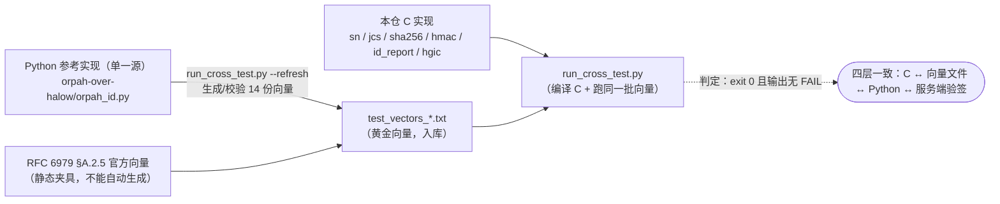

# proto/ — 协议内核（C 实现）+ 与 Python 的交叉测试

**状态（2026-09-22，c2 + c4-α + c3 帧层 + c4-β 曲线层 + c4-β-2 签名 + **c4-β-3 ES256 接进报文**）：SN / JCS / b64url / 报文信封 /
下行解码 / SHA-256 / HMAC-SHA256 / 设备侧已签报文（**ES256 + HS256 + none**）/ HGIC 帧层 /
**P-256 曲线（素域+群+标量乘+公钥派生）** / **ECDSA 签名（`r||s` + RFC 6979 确定性 `k`，
对 RFC §A.2.5 官方向量逐字节一致）** 全部完成**，交叉测试 **14 组**；
并且**服务端（上游 `verify_report`）验签通过** C 产出的报文 —— 含 **level=0（ES256）** 共 6 条。
剩余：HGIC 的**上机**（c3-2b：UART2 ↔ 模组，引脚待定 + 要你烧录）；**固件 main 还没调 `idr_build`**
（c4-γ：把已签上报接进主循环 + `payload.nonce` 的来源 —— 规范写的是 **ATECC608B RNG**，
⇒ 等 SE 接线；`idr_build()` 已由调用方传 nonce，**不塞假随机**）。

## 为什么要这一层

同一套协议内核要跑在两个地方：PC 上的**上游 Python 参考**，和固件里的 **C**。
两边只要有一处字节不一致，签名就验不过（`signature_invalid`）—— 所以判定**不靠人眼对文档**，
靠**同一批黄金向量对拍**（`../AGENTS.md` §4 定的口径：退出码 0 且输出无 `FAIL`）。

**判定链长这样**（实线 = 产物/数据流，虚线 = 判定）：



## 本仓不定义协议

单一源永远在上游：`orpah-over-halow/orpah_id.py`（SN/校验位）与
`Protocol/docs/OrpahIDProtocol.md`（规范）。本目录的 C 只是**移植**；有出入以 Python 为准。

## 文件

| 文件 | 作用 |
|---|---|
| `sn.h` / `sn.c` | SN 内核：Crockford / `sn_ok` / `sn_err` / `sn_parse` / Luhn32 / Mod97 / `sn_verify_check`。**无 malloc、无 stdio ⇒ 可直接编进固件** |
| `jcs.h` / `jcs.c` | **RFC 8785 JCS 规范化**（我们用到的那部分）+ 迷你 JSON 构建器；`jcs_preimage()` = `orpah_id.preimage_of`。**不用 stdio/malloc/浮点 ⇒ 可编进固件** |
| `msg.h` / `msg.c` | 链路报文构造器：`msg_req_connect` / `msg_report` / `msg_id_report`（对齐 `orpah_proto._base`+`build_*` 的**插入序**）。`id-report` 的 `sn` 取**内层 payload.sn** |
| `downlink.h` / `downlink.c` | **下行解码**：`dl_decode()`（同 `decode_msg`：必为对象 + `type` 已知）+ `dl_type/dl_str/dl_int/dl_truthy`（Python 真值语义） |
| `sha256.h` / `sha256.c` | **SHA-256**（FIPS 180-4）：`sha256_init/update/final` + 一次性 `sha256()`。§5.1 的 `SHA-256(preimage)` 用；也是将来 RFC 6979 确定性 k 的前置 |
| `hmac.h` / `hmac.c` | **HMAC-SHA256**（RFC 2104）：`hmac_sha256(key, keylen, msg, msglen, out)` = §5.1 的**降级 HS256**（**直接对 preimage 做 HMAC**，不再先哈希） |
| `id_report.h` / `id_report.c` | **设备侧已签报文组装**：`idr_build()` 组 hdr+payload → 预像 → 签名（**level 0 = ES256**（`ec_priv` 32 B 标量 + RFC 6979）、**level 1/2 = HS256**、**level 3 = 不签名**）→ 输出报文 JSON。私钥**由参数传入**（不取全局、不从报文取）—— 将来换 ATECC608B 只改调用方 |
| `b64url.h` / `b64url.c` | base64url（无填充），对应 `orpah_id.b64url_encode` |
| `sn_cli.c` / `jcs_cli.c` / `sha_cli.c` / `hgic_cli.c` | host 侧 CLI（对拍/调试用；**不编进固件**）。`jcs_cli` 管 JCS/b64url/报文/下行四组；`hgic_cli` 管 HGIC 三组 |
| `run_cross_test.py` | 一键对拍：生成/校验向量 + 编译 C + 三方比对 |
| `test_vectors_sn.txt` | `ORG-UNIQUE<TAB>LUHN32<TAB>MOD97`（63 行） |
| `test_vectors_snparse.txt` | `SN<TAB>ok<TAB>err<TAB>verify`（19 行） |
| `test_vectors_jcs.txt` | `<case-name><TAB><jcs-hex>`（12 行；case 名与 `jcs_cli.c` 的 `build_case()` 一一对应） |
| `test_vectors_b64url.txt` | `<raw-hex><TAB><b64url>`（17 行，含 0/1/2 字节三种余数与字母表里的 `-` `_`） |
| `test_vectors_msg.txt` | `<kind><TAB>a1..a5<TAB><envelope-hex>`（8 行：req-connect / report / id-report） |
| `test_vectors_downlink.txt` | `<json-hex><TAB>valid/type/sn/ts/tracked/status/code`（11 行：3 种下行 + 5 种畸形 + 1 个真值语义） |
| `test_vectors_sha256.txt` | `<input-hex><TAB><digest-hex>`（16 行：空 / 块边界 55~129 / 1000B / **真实签名预像**） |
| `test_vectors_hmac.txt` | `<key-hex><TAB><msg-hex><TAB><mac-hex>`（13 行：空键 / 键 32~128（含**超分组必须先哈希**）/ **真实降级路径**） |
| `test_vectors_id_report.txt` | 8 个参数 + `<report-hex><TAB><envelope-hex>`（7 行：level 0/1/2/3、带与不带 cap+battery+firmware）。⚠ 第 5 列 `key-hex` 的含义**按 level 分**：0 = P-256 私钥 d，1/2 = HMAC 密钥，3 = `-` |
| `hgic.h` / `hgic.c` | **HGIC 帧层**（模组主机口）：8 B 头组/解、`FRM2`/`CMD`/`CMD2`、cookie 计数器（15 位回绕）、控制面解码（应答/短应答/请求/事件）、**流式定帧 + 重同步**。**无 stdio/malloc/string.h ⇒ 可编进固件** |
| `hgic_cli.c` | HGIC 的 host 侧 CLI（`frm2`/`cmd`/`hdr`/`feed`/`ctrl` 单次子命令 + `selfcheck` + 三个 `*-selftest`） |
| `test_vectors_hgic.txt` | `<kind><TAB><a1..a6><TAB><frame-hex>`（14 行：hdr/frm2/cmd；含整帧 8 与 4096 两条边界、CMD↔CMD2 分界） |
| `test_vectors_hgic_parse.txt` | `<expect><TAB><流-hex><TAB><chunk><TAB><frames><TAB><garbage><TAB><bad_length><TAB><overrun>`（12 行：逐字节喂 / 杂音 / 假 magic / 截断 / 方向过滤） |
| `test_vectors_hgic_ctrl.txt` | `<type><TAB><from><TAB><载荷><TAB><rc><TAB><kind><TAB><id><TAB><status><TAB><data-hex>`（13 行） |
| `p256.h` / `p256.c` | **NIST P-256 曲线**：素域（32 位 limb + **Montgomery 乘** + 费马求逆）、Jacobian 点运算、**Montgomery ladder 标量乘**、公钥派生（未压缩点 `04||X||Y`）、演示私钥派生（同上游 `derive_demo_privkey`）。**无 stdio/malloc/浮点/string.h ⇒ 可编进固件**。⚠ **不做常量时间**（见文件头） |
| `p256_cli.c` | P-256 的 host 侧 CLI（`pubkey` / `pubkey-sn` / `on-curve` / `fe` 单次命令 + `selfcheck` + `pubkey-selftest`） |
| `test_vectors_p256.txt` | `<kind><TAB><a1><TAB><a2><TAB><d-hex><TAB><pub65-hex>`（14 行：`sn` 类看派生规则；`d` 类含 `d=1`→G、`n-1`→-G、`n+1` / `n+0x1234`（**未归约**标量）、4 个定种子随机 d） |
| `rfc6979.h` / `rfc6979.c` | **RFC 6979 确定性 `k`**（只做 P-256 + SHA-256）：K/V 迭代 + `bits2octets`（qlen=256 ⇒ **最多减一次 n**）。用它的理由：设备侧**没有可信熵源**，而 k **复用/可预测就泄漏私钥**；副作用是**同一输入必得同一签名** ⇒ 可拿官方向量逐字节对拍。**无 stdio/malloc/浮点/string.h ⇒ 可编进固件** |
| `ecdsa.h` / `ecdsa.c` | **ECDSA(P-256) 签名，输出 `r||s`（64 B，与上游 `_sign_es256` 同格式）**。内部只新写 **mod n 的 256 位算术**（乘 + 逐位长除法归约 + 费马求逆）；`k*G` 直接复用 `p256_pubkey_from_priv`（“以 k 为私钥的公钥”就是 k*G，不必再暴露生成元）。⚠ **不做 low-s 归一化**、**不做常量时间**、**不做验签**（理由见下面 c4-β-2 那节） |
| `ecdsa_cli.c` | ECDSA/RFC 6979 的 host 侧 CLI（`h1` / `k` / `k-msg` / `sign` / `sign-msg` / `sign-k` + `selfcheck` + `k-selftest` / `sign-selftest`） |
| `test_vectors_ecdsa.txt` | `<label><TAB><d><TAB><h1><TAB><k><TAB><r><TAB><s>`（25 行：演示私钥×3 消息、`h1` 边界（**含 `>= n` 那一条**）、私钥 1/2/n-1 + 定种子随机） |
| `test_vectors_ecdsa_rfc6979.txt` | ★ **静态夹具**（**不由 `--refresh` 生成**）：RFC 6979 §A.2.5 的 P-256/SHA-256 两组（`sample` / `test`）。凭什么信它见下面 c4-β-2 那节 |

> **十四份**向量文件**由 Python 参考实现生成（勿手改）**，统一用 `--refresh` 重生
> （HGIC 三份的参考在**本仓** `tools/txah_hgic.py`，其余十一份在上游 `orpah-over-halow`）。
> 另有 **1 份静态夹具** `test_vectors_ecdsa_rfc6979.txt`（RFC 官方向量）——
> **`--refresh` 不会改写它**，它由三条独立验证守着（见下节）。

## 跑

```bash
python proto/run_cross_test.py                 # 判定：exit 0 且输出无 FAIL
python proto/run_cross_test.py --refresh       # 用 Python 重写向量（核对 diff 再提交）
python proto/run_cross_test.py --orpah-dir ../orpah-over-halow
```

它对三件事下结论：

1. **C 侧自检**（五个可执行目标）：
   · **SN 内核**：`selfcheck`（11 项）+ `selftest`（63 行校验位）+ `sn-selftest`（19 行 SN 解析）
   · **JCS/b64url/msg/dl**：`selfcheck`（4 项）+ `jcs-selftest`（12 行）+ `b64url-selftest`（17 行）
     + `msg-selftest`（8 行报文信封）+ `dl-selftest`（11 行下行解码）
   · **SHA-256/HMAC**：`selfcheck`（**分块自洽 3345 项** + 两条 HMAC 不变量：键超分组等价于其摘要当键；
     空消息的两种写法一致）+ `sha256-selftest`（16 行）+ `hmac-selftest`（13 行）
   · **HGIC 帧层**：`selfcheck`（不变量）+ `frame-selftest`（14 行帧构造）
     + `parse-selftest`（12 行流解析/重同步）+ `ctrl-selftest`（13 行控制面）
   · **P-256 曲线**：`selfcheck`（不变量）+ `pubkey-selftest`（14 行公钥派生，与 OpenSSL 逐字节一致）
   · **ECDSA/RFC6979**：`selfcheck`（不变量，含 `k=1,d=1,h1=0 ⇒ r=s=Gx`、`h1` 与 `h1-n` 同签名、
     非法输入必报明确错误码）+ `k-selftest`（**RFC 6979 官方 `k`，2 行**）
     + `sign-selftest`（**官方 `r||s` 2 行** + 本仓 25 行）
2. **快照没过期**：十四份向量文件与 Python 参考**逐行一致**；另加一步：**静态 RFC 夹具**的三条验证
   （key pair 自洽 / `h1 == sha256(label)` / `k == 本仓 Python RFC6979` 且 `(r,s)` 过 OpenSSL 验签）；
3. **服务端收得下**（★ 最重要的一步）：把 **C 产出的报文**交给上游 `orpah_id.verify_report()`
   （配上 `KeyStore`）+ 真验一遍 ⇒ `level=1/2` 必须 `accepted=True` 且级别对得上
   （L3 / `alg=none` 只陈述：规范 §8.3 它就是“只做覆盖”）。
   —— 字节一致只证明“两边一样”，这一步才证明“**服务端真的收得下**”（离线版的服务端判据）。
   同类的一步：拿 `ecdsa_cli sign` 的输出去过 **OpenSSL 验签**（`Prehashed`）——
   **字节一致只说明两边一样，验签才说明这确实是一份合法签名**。
4. 合起来 ⇒ **C ↔ 向量文件 ↔ Python ↔ 服务端验签** 四层一致。

⚠ 找不到上游参考实现时，脚本会**明确打印"未与 Python 交叉验证"**（但仍退出 0，因为 C 侧自检确实过了）——
别把那种 PASS 当成已交叉验证 ✓。

## HGIC 帧层（c3）：单一源在**本仓**，不在上游

这一层与上面几组不同：它的单一源是 **本仓** `tools/txah_hgic.py`（来历 = 模组 SDK
`sdk/include/lib/lmac/hgic.h` + `sdk/lib/bus/macbus/uart_bus.c` + 2026-09-16/20 真机实测），
**不需要上游仓库** ⇒ 三组 HGIC 向量与 C 自检在没有 `orpah-over-halow` 时照样会跑。

| 判据 | 怎么测出来的 |
|---|---|
| 8 B 头、**小端**、`ifidx:4\|flags:4` 按位打包 | `test_vectors_hgic.txt` 的 `hdr` 类（含 `ifidx=5,flags=10` 与全 1 边界） |
| 整帧长度 = 8 + 载荷（`uart_bus.c` 的定帧依据）、上界 4096 | 同上：空载荷（整帧 8）与**恰好 4096** 两条边界 |
| 数据面 = `FRM2`（8 B 头 + 载荷紧跟，不带 24 B frm_info） | `frm2` 类；与 `tools/hgic_bus.py` 真机在用的那条路径一致 |
| 命令帧的 4 B union **必须补满**（参数在偏移 12） | `cmd` 类的带参用例 + `selfcheck` 直查 `frame[12]` |
| `id > 255` 走 `CMD2`(13) | `cmd 255` / `cmd 256` 两条边界 |
| cookie 逐帧 +1、15 位回绕 | `hdr` 类的 cookie 0/4660/32767 + `selfcheck` 的回绕用例 |
| 重同步（杂音 / 假 magic / 截断 / 逐字节喂） | `test_vectors_hgic_parse.txt` 12 行（`expect` × `chunk` × 畸形流） |
| 方向过滤（固件只收模组→主机） | 同上 `expect=rx\|tx` + 两种 magic 混流的用例 |
| 控制面三种形状（带 status/len 的应答 / 短应答 / 请求与事件） | `test_vectors_hgic_ctrl.txt` 13 行 |

**与 Python 的有意差异只有一个**：`hgic_parser_t.overrun`（C 的缓冲上界 4096，Python 无上限）。
向量里这一列恒为 0 —— 收录它是为了钉住“合法数据永不触发它”。

⚠ **大小端最容易错的一点**：magic 是**小端 u16** ⇒ 字节 `2B 1A` = `0x1A2B`（主机→模组）、
字节 `1A 2B` = `0x2B1A`（模组→主机）。写向量或抓包时别把这两串看成一回事
（2026-09-20 自检就踩过一次：拿主机方向的帧去喂 `expect=rx` 的解析器 ⇒ 4 项红，
而向量组早已独立证明方向过滤是对的 —— **错的是我的测试数据，不是实现**）。

## ★ 一条最要紧的事实：校验位算法是 **Luhn32 / Mod97**，不是 Damm32

`orpah_id.verify_check()` 按**校验位长度**分流：

| 校验位长度 | 算法 | 本仓 C |
|---|---|---|
| 0 位 | 无校验，直接通过 | `sn_verify_check` |
| **1 位** | **Luhn32**（Luhn mod 32，Crockford） | `sn_verify_check_luhn32` |
| **2 位** | **Mod97**（IBAN 思路，输出 02–98） | `sn_verify_check_mod97` |

Damm32（`orpah-over-halow/damm32.py`）是**Phase 2 的替代算法**，`verify_check` 当前**不启用**它
（其自身注释也写着 32×32 表"待定稿"）。固件应当照 `verify_check` 实现 ✓。

## JCS 实现的范围与边界（写代码前先看这段）

对齐的是 **Python 的 `json.dumps(ensure_ascii=False, sort_keys=True, separators=(",",":"))`**，
不是“纯理论上的 RFC 8785”：

| 项 | 本实现 | 说明 |
|---|---|---|
| 键排序 | 逐字节字典序 | = Python 的码点序（UTF-8 字节序 == 码点序）✓。⚠ 真 JCS 按 **UTF-16 码元**排，遇**非 BMP**字符（>U+FFFF）会与 Python 不同 —— 我们报文的键全是 ASCII，用不到，但这道差异要知道 |
| 数字 | **只有整数** | 不提供浮点：从根上避开“Python 的最短往返表示”那种跨语言不一致（我们的报文也确实只用整数） |
| 字符串 | 非 ASCII 原样 UTF-8；只转义 `"` `\` 与控制字符（`\u00XX` 小写十六进制） | 对应 `ensure_ascii=False` |
| 内存 | 调用方给的 arena（固定数组），**无 malloc** | 裸机 `-nostdlib` 可用；arena 单次使用，不做回收 |
| 错误 | 返回负的错误码（节点/池/容量/重复键/缓冲不够），**绝不静默截断** | 重复键在 Python 里不可能出现 ⇒ C 侧报了才安全 |

## ★ 两个编码器别用错：**签名预像用 JCS，链路信封用插入序**

| 用途 | Python | C |
|---|---|---|
| **签名预像** `preimage_of` | `json.dumps(..., sort_keys=True, separators=(",",":"))` | `jcs_encode()` / `jcs_preimage()` —— **排序** |
| **链路报文** `encode_msg` | `json.dumps(..., separators=(",",":"))` —— **不带** `sort_keys` | `jcs_encode_raw()` —— **保持插入序** |

所以：报文 JSON 里的键序要求**逐字节复现 Python 源码里的插入顺序**（`msg_report` 是
`v,type,ts,sn,seq,cap,rssi` ✓）；而签名预像才走 JCS 排序。两者混了就是“能发出去但服务端验不过”。

## JSON 解析器的**已知边界**（解析器在 `jcs.c`，下行用）

解析器**有意比 Python 的 `json` 严**（我们的报文不会长成这些形状 ⇒ 真收到了宁可报错，不要猜）：

| 输入 | Python `json.loads` | 本 C |
|---|---|---|
| `1.5` / `1e3`（浮点/指数） | 接受 | **拒**（我们报文只用整数） |
| 超出 int64 的整数 | 接受（任意精度） | **拒** |
| 嵌套 > 8 层 | 接受 | **拒** |
| 重复键 | 后者覆盖前者 | **拒**（Python dict 不会重复，报了才安全） |
| 孤立代理项 `"\ud800"` | 接受（得到一个孤立代理） | **拒**（无法编成合法 UTF-8） |
| `NaN` / `Infinity` | 默认接受 | **拒** |

⇒ 所以 `test_vectors_downlink.txt` **只收录“Python 也说无效”的无效用例**（坏 JSON / 顶层非对象 /
未知 type / 截断），上面这几条**不入向量**（否则会变成用一个已知差异去“证明”零偏差）。

## 六条踩过的坑（都写进代码注释了，别再踩）

1. **Luhn32 ≠ Damm32，期望值必须来自 Python 输出，不能凭记忆**：
   本仓 AGENTS 里那句"黄金样本 `WH01-9AF3C1D2 → B`"说的是 **Damm32**；
   **Luhn32 真值是 `E`、Mod97 是 `21`**（而且恰好有另一个输入 `T` 的 Luhn32 是 `B`，更藏得住混淆）。
   我第一次在 `sn_cli.c` 里就写成了 `B` ⇒ 自检当场失败（这正是"别凭记忆写常量"的活教材）。
2. **cmd 里调 `vcvars64.bat` 必须写 `call`**：不带 `call` 时 cmd 把控制权交给批处理就不回来了，
   后面的 `&& cl ...` **永远不执行**，现象是"退出码非 0 且**没有任何输出**"，极难查。
   （上游 `orpah-over-halow/c/run_cross_test.py` 少写了 `call`，那条 MSVC 兜底路径实际跑不通。）
3. **`subprocess` 必须 `encoding="utf-8", errors="replace"`**：Windows 上默认按 GBK 解码子进程输出 ⇒
   读线程抛 `UnicodeDecodeError` 且 **`stdout` 变成空** ⇒ 报错看起来"什么都没打印"。4. **大块代码替换后必须回读确认**：一次多替换里报了“成功”，实际上那块 `arr_mixed` 仍是旧版
   （现象是 C 输出 `{}`、只差 1/12），查了几轮才定位。⇒ 改完**大块/关键逻辑**后，
   用 `read_file`/`grep` 回读一眼，别只看工具回执 ✓。
5. **用字符串当“缺省”哨兵时，小心它和真数据撞车**：报文用例里我用 `-` 表示“字段不给”，
   但 **RSSI 是负数**（`-55` 开头就是 `-`）⇒ 一律被当成“不给”，`msg-selftest` 当场挂 4/8。
   正确做法：只有**整字段**正好等于 `-`（`strcmp(s, "-") == 0`）才算缺省 ✓。
6. **提交的向量必须确定性 ⇒ 任何“依赖当前时间”的东西要么置 0、要么把时间钉住**：
   我在 id-report 向量里硬编码了一个当时从台架日志抄来的 `ts`，过一会儿再跑，
   `verify_report` 就回 `timestamp_out_of_window`（签名其实已经过了）⇒ 3 项 FAIL。
   做法：`ts=0`（= 真机无 RTC 的正常路径）不传 `now`；非零 ts 则把 `now` **钉到向量那个值**，
   并在注释里说明“时间窗是另一个机制、由上游测试负责”。
## 下一步（c2 未完）

报文编解码 + **JCS（RFC 8785）规范化** + `b64url` + **签名预像**。
JCS 是要害（键序按 UTF-16 码元、数字最短表示，差一个字节整条链就验不过），
同样按"**黄金向量 + 对拍**"做，**不与本目录的 SN 内核混在一起**（一次只动一件事）。

## ES256 接进报文（c4-β-3，2026-09-22）

`idr_build()` 的 level=0 路径 = **SHA-256(预像) → ECDSA(P-256) → `r||s`(64 B) → b64url → 写进 `sig`**，
与 Python 参考的 `Device.report()` 逐字节一致（参考实现的 `es256_sign` 也是 raw `r||s` + b64url）。
私钥从参数进（`ec_priv`，32 B 大端）—— 规范 §6 的真机是“密钥在 SE 内生成且不可导出、签名也在 SE 里”，
所以这里**不把私钥写死在任何地方**，将来换 ATECC608B 只改调用方。

### 为什么向量里的 level=0 要换成确定性 k

参考实现 `Device.report()` 走 `cryptography` ⇒ **随机 k**，同一条报文两次签名不同 ⇒ **逐字节比不了**。
规范对 k 无规定（`ecdsa.h`：“k 的来源由调用方给”），所以 `idr_row()` **只换 k 的来源**
（`_det_es256()` 用本仓 Python RFC 6979），hdr/payload/预像结构/编码仍全部由参考实现产出。

这样“逐字节一致”证明的是**两边实现一致**；而“这确实是一份合法签名”另有**三条独立证据**：
① RFC 6979 §A.2.5 官方向量（`test_vectors_ecdsa_rfc6979.txt`，静态夹具）；
② OpenSSL 验签 C 产出的 `r||s`；③ **上游 `verify_report` 接受 C 产出的 level=0 报文**。

### ★ 一个“同一个含义在两处各写一份”的实拍

我第一版把“第 5 列是哪种 key”分别写在两个地方：生成向量时认 level（0→私钥 d）、
验签循环时却写死 `derive_demo_hmac()` ⇒ C 侧**自洽**（自己签自己验都能过，`id-report-selftest` 7/7）
但服务端回 **`signature_invalid`**。改成 `_idr_key_hex()` 单一来源后 6 条 level=0/1/2 全过。
**症状很典型：两层各自自洽、只剩接线处对不上。**

判据（均实测）：`python proto\run_cross_test.py` → **exit 0**（14 组），
`C id-report-selftest` **7/7**（含 2 条 ES256 逐字节一致），
`verify_report` 接受 **6 条** level=0/1/2，固件 `make` exit 0。

## ECDSA / RFC 6979（c4-β-2）：k 为什么是确定性的，那张静态夹具凭什么可信

### k 用 RFC 6979 确定性派生（而不是随机）

设备侧**没有可信熵源**（ATECC608B 未接线、CH32V203 也没有可用 RNG），而 ECDSA 的 `k`
**一旦重复/可预测就泄漏私钥**（同一 k 签两条 ⇒ 联立即可解出私钥）。RFC 6979 用 `HMAC_DRBG`
从 (私钥 x, 消息哈希 h1) 导出 k ⇒ **不需要熵源**；副作用是**签名可确定性复现**，于是能拿官方
向量逐字节对拍 —— 这是这个方案最大的工程好处（**可测**）。

⚠ 与规范的关系：§5.1 只规定 `sig = ECDSA-P256-sign(privkey, SHA-256(preimage))`，**k 怎么来规范不管**；
`OrpahIDProtocol.md` §5.4 表里的 `nonce` 是**报文防重放字段**（要求 ATECC608B RNG），与 k 是两件事。

### ★ 为什么有一张**不能自动生成**的向量表

`test_vectors_ecdsa_rfc6979.txt` 是 RFC 6979 §A.2.5 的官方向量（P-256 + SHA-256，`sample` / `test`）。
不能由脚本生成的原因很实在：**OpenSSL 的签名接口只吐随机 k 的签名**，本机也没有 `ecdsa` 库
⇒ 官方的 `k/r/s` 只能**手工录入**。手工录入就靠**三条互相独立的验证**兜底
（`check_ecdsa_rfc_fixture()`，每次跑脚本都执行）：

| # | 验证什么 | 防的是什么 |
|---|---|---|
| ① | 夹具的私钥派生出的公钥 == RFC 的 `Ux/Uy` | key pair 抄串行 |
| ② | `h1 == SHA-256(label 的 UTF-8 字节)` | 消息名抄错（h1 与 message 对不上） |
| ③ | `k == 本仓 Python RFC 6979`，且 `(r,s)` 过 **OpenSSL 验签** | k 抄错 / r,s 抄错 |

③ 里的“k”用的是**本仓自己写的 Python 第二实现**（`rfc6979_k_py`）—— 它凭什么能当参照？
因为**它也必须复现官方夹具的 k**（两条 message 都过）⇒ 它不是“另一份可能同样错的实现”。

> 实测背景（2026-09-20）：我笔记里记的 `test` 那条 `k` 读起来像 65 个十六进制字符（奇数 = 不可能）
> ⇒ 于是改用**可验证的路子**定它：`k` 由官方 `(r,s)` 唯一反推 `k = (h + d·r)·s⁻¹ mod n`，
> 再用 OpenSSL 验 `(r,s)`、再与本仓 Python RFC 6979 对三条 —— 三方一致才写进夹具。
> 教训：**夹具里每个数字都要有能自动重算的参照**，凭记忆/凭眼看都不算。

### 三条如实边界（别当“已防住”）

1. **不做常量时间**：mod n 归约是教科书式逐位长除法，私钥相关分支/访存可辨。演示台架可以；
   真机若私钥在 MCU 内签名，必须换常量时间实现，或交给 ATECC608B 签。
2. **不做 low-s 归一化**：官方向量里 `sample` 那条的 `s` 就 > n/2。归一化会对不上官方夹具；
   验签方本来就两种都收。（这也是“别自作主张优化”的一个实例。）
3. **不做 C 侧验签**：自己验自己只是“自洽”，证据力弱。判据用外部实现 —— host 侧 OpenSSL、
   端到端用上游 `orpah_id.verify_report()`。

### 性能（如实的代价）

费马求逆 = 256 次平方 + ~128 次乘，每次模乘要做一次 512 步长除法 ⇒ **host 上毫秒级、8 MHz 固件
上秒级**。签名是低频动作（设计常态 60 s/次）⇒ 够用；要快得上 Barrett/Montgomery 或二进制
扩展欧几里得求逆。

## c4-γ-1：设备侧**流水线**（选级 / 演示密钥 / nonce / 整帧）—— 2026-09-22

起因：c4-β 把签名做完了，但"设备怎么**组装并发出**一条已签上报"这条流水线还没落地，
而且它是**固件**与 **PC 侧**都要跑的（固件主循环要发；PC 侧要对拍、上机后还要拿固件打出来的
字节去验）。两处各写一遍的坏法是"参数/顺序差一点"⇒ 服务端回 `signature_invalid`（C 侧看是自洽的）。
⇒ **只写一份**，放 `proto/`，两侧都调它：

| 文件 | 管什么 | 单一源 |
|---|---|---|
| `id_level.{h,c}` | §8.2 选级 + 故障注入模式表 | 上游 `orpah_id.pick_level` / `LEVEL_MODES` |
| `id_keys.{h,c}` | 演示密钥材料（EC 私钥 + HMAC 降级密钥） | 上游 `derive_demo_privkey` / `derive_demo_hmac` |
| `id_nonce.{h,c}` | `payload.nonce` 来源（**软熵后端**，可换 SE） | **本仓定义**（规范只要求"来源是 SE 的 RNG"） |
| `id_build.{h,c}` | 流水线：选级 → 取钥 → nonce → `idr_build` → 信封 → 以太帧 | 上面四个 + 上游 `build_id_report` / `build_eth_frame` |
| `id_cli.c` | **主机侧** CLI（对拍/复现；**不编进固件**） | —— |

固件侧只有一个薄外壳 `firmware/Core/id_core.c`（什么时候发、自限频、控制台、计数）。

### 判据（均实测：`python proto\run_cross_test.py` → exit 0，交叉测试 **15 组**）

- `C selfcheck`：模式表/四条选级路径/nonce 不变量/**缓冲不够必须报错**/§8.2 Step2 降级路径/按固件缓冲跑四档；
- 四张新向量与 Python 逐行一致：`id_keys`(4) / `id_level`(13) / `id_nonce`(5) / `id_frame`(5)；
- ★ **让上游 `verify_report()` 收下 C 产出的整帧**（4 条 level=0/1/2 全过；level 3 按 §8.3 只陈述）
  —— 这就是"上机要看的那一条"，与固件发出去的是**同一条流水线**，差别只有"经不经 UART/空口"；
- 上机判据工具：`python tools\check_report_hex.py <hex>`（把固件 `idhex` 打出来的帧交给上游判一次）。

### 这次踩到的两个 bug（都值得记住，都是"一次一进程的 CLI 恰好掩盖"型）

1. **`idb_init()` 没清零"密钥已派生"标志** ⇒ `_ensure_keys()` 把**栈垃圾**当成"派生过了"，
   直接拿垃圾字节签名。现象极隐蔽：**同进程第一条对、第二条起错**（`id_cli frame-selftest`
   是循环调用 ⇒ 只有 3/5 行对；`dev-frame` 一次一进程 ⇒ 全对）。
   ⇒ 与 c4-β-2 那次（`ecdsa_cli` 的 `k1` 只写末字节、前 31 字节是栈垃圾）**是同一类错**：
   凡整段参与运算的缓冲/标志，**必须显式清零**。
2. **`idr_build()` / `jcs_encode_raw()` 的输出不带结尾 NUL**（jcs 家族一贯如此，返回长度）
   ⇒ 用 `strlen()` 读它会读到**上一行的残留**（长度看着"像对"，内容错）。
   ⇒ `idb_t` 现在记 `last_rep_len`/`last_env_len`，对外**只给长度**。

### 如实边界

- **nonce 是"非生产强度"**：软熵后端只有几十 bit 熵且可预测（见 `id_nonce.h` 文件头）。
  真正要紧的后果不是"被猜出来"，而是**撞车** ⇒ 服务端按重放丢弃 ⇒ 对我们就是**一次漏报**。
  它只保证"同一 boot 内不重复 / 随 SN 与上电熵变化"。d 步换 ATECC608B 的 `Random(0x1B)`
  —— 交换点只有一处（`Core/id_core.c` 的 `idc_next_nonce` 那条线）。
- **`se_ok` 是软件 P-256 替身**（ROADMAP §五已定：SE 驱动在 d 步）⇒ 固件里 level=0 是**演示级**
  （密钥在 MCU 内、非 SE 保护），启动横幅与控制台 `id` 都如实标 `SE=NONE (demo software key)`。
- 缓冲区推荐尺寸（`IDB_REC_*`：报文 768 / 信封 864 / 帧 896）是**实测**值（≤616 / ≤~700 / ≤790）
  加余量；C 侧自检**按这几个尺寸跑四档**，以免"上机才发现缓冲不够"。
